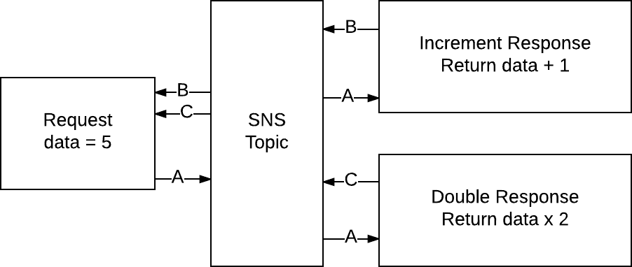
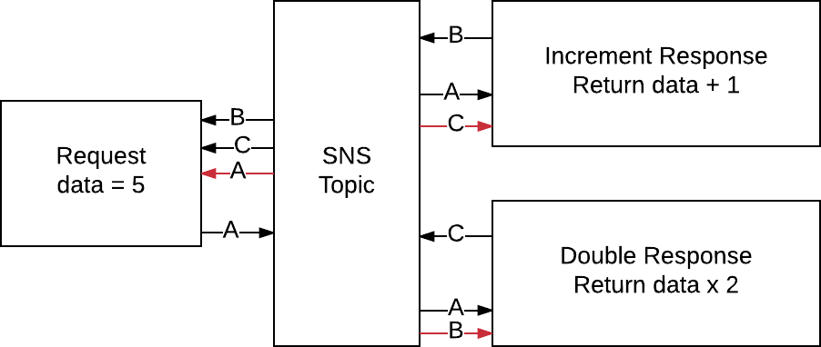

# aws-scatter-gather

The purpose of this module is to facilitate distributed computing while using a scatter gather design pattern with AWS SNS Topics.

An **Aggregator** makes a request via AWS SNS that any number of **Value Object Generators** can respond to.

## Install

```sh
$ npm install aws-scatter-gather
```

## Basic Example

For this example, assume we have a single SNS Topic and three AWS lambdas that are subscribed to it:

- **Aggregator** - Makes a request to other lambdas to do mathematical calculations on a number, and gathers responses.
- **Increment** - A value object generator that accepts a request, adds `1` to the number, and sends a response back.
- **Double** - A value object generator that accepts a request, doubles the number, and sends a response back.

The following diagram outlines the basic flow of this information when using an AWS SNS Topic:



1. The Aggregator sends an event to the SNS Topic. The event is formatted in such a way that both Increment and Double can recognize it as a Scather request.
2. The SNS Topic causes both Increment and Double to run.
3. Increment and Double do their processing and push a new event to the SNS Topic. This event is formatted in such a way that the Aggregator knows that the response event is intended specifically for it.
4. The Aggregator compiles the responses.

#### Code Examples

**Aggregator**

```js
const AWS       = require('aws-sdk');
const Scather   = require('aws-scatter-gather');

exports.handler = function(event, context, callback) {

    // define the request configuration
    const config = {
        expects: [ 'increment', 'double' ],
        topicArn: 'arn:aws:sns:us-west-2:064824991063:TopicY'
    };

    // make the request
    Scather.request(5, config, function(err, data) {
        if (err) {
            callback(err, null);
        } else {
            // data: { increment: 6, double: 10 }
            callback(null, data);
        }
    });

    // Because we just return the data, the previous
    // code block can be simplified to this:
    // Scather.request(5, config, callback);
});
```

Note the comment at the end of the Aggregator example. Because we simply return the aggregated data to terminate the lambda, we could have called the lambda's callback function directly: `Scather.request(5, config, callback);`

**Increment**

```js
const AWS       = require('aws-sdk');
const Scather   = require('aws-scatter-gather');

// define the SNS post handler
exports.handler = Scather.response(function(data, meta, callback) {
    callback(null, data + 1);
});
```

**Double**

```js
const AWS       = require('aws-sdk');
const Scather   = require('aws-scatter-gather');

// define the SNS post handler
exports.handler = Scather.response(function(data, meta, callback) {
    callback(null, data * 2);
});
```

It should be noted that there is a flaw in the basic example design that you may or may not be willing to live with. Take a look at this more accurate representation of the basic example:



Because there is a single SNS Topic for all traffic, the Aggregator lambda will start another Aggregator lambda to look at the event that it will ultimately ignore. Also, the Increment and Double lambda will fire up other Increment and Double lambdas to look at responses that are ultimately ignored.

To overcome this we can look to the [Better Example](#better-example).

## Better Example

For this example, assume we have two SNS Topics and three AWS lambdas.

The three lambdas are:

- **Aggregator** - Makes a request to other lambdas to do mathematical calculations on a number, and gathers responses.
- **Increment** - A value object generator that accepts a request, adds `1` to the number, and sends a response back.
- **Double** - A value object generator that accepts a request, doubles the number, and sends a response back.

The following diagram outlines the flow of this information when using two AWS SNS Topics:


1. The Aggregator sends an event to the SNS Topic that Increment and Double are subscribed to. The event is formatted in such a way that both Increment and Double can recognize it as a Scather request.
2. The SNS Topic causes both Increment and Double to run.
3. Increment and Double do their processing and push a new event to the SNS Topic that the Aggregator is subscribed to. This event is formatted in such a way that the Aggregator knows that the response event is intended specifically for it.
4. The Aggregator compiles the responses.

#### Code Example

The Increment and Double lambdas have no change to their code from the previous [Basic Example](#basic-example). The Aggregator lambda adds a `responseArn` property to it's configuration. The responding lambdas will automatically send their responses to the specified responseArn. That's the only code change.

**Aggregator**

```js
const AWS       = require('aws-sdk');
const Scather   = require('aws-scatter-gather');

exports.handler = function(event, context, callback) {

    // define the request configuration
    const config = {
        expects: [ 'increment', 'double' ],
        responseArn: 'arn:aws:sns:us-west-2:064824991063:TopicX'
        topicArn: 'arn:aws:sns:us-west-2:064824991063:TopicY'
    };

    // make the request
    Scather.request(5, config, callback);
});
```

## Unsubscribed Machines

If you are running code on a machine that does not already have a subscription to the AWS SNS Topic of interest then you'll need to create that subscription. Without the subscription you will not have two way communication. To create a subscription:

- You must specify the SNS Topic Arn
- The machine must be reachable by AWS, which means it must have a public endpoint.

If your machine is being used only for development and you don't want to create a public endpoint to your machine then there is an option to [set up tunneling](#scather-subscribe) to make your machine reachable.

[More About the Subscription API](#scather-subscribe)

**Subscribe to SNS Topic**

```js
const AWS       = require('aws-sdk');
const Scather   = require('aws-scatter-gather');

const config = {
    endpoint: 'http://public.endpoint.com',
    topicArn: 'arn:aws:sns:us-west-2:064824991063:TopicX'
};

const sub = Scather.subscription(config);
sub.start(function(err, data) {
    if (err) {
        console.error(err.stack);
    } else {
        console.log('Subscription ready');
    }
});
```

**Unsubscribe from an SNS Topic**

When the machine shuts down, you might want to end the subscription too:

```js
const AWS       = require('aws-sdk');
const Scather   = require('aws-scatter-gather');

const config = {
    topicArn: 'arn:aws:sns:us-west-2:064824991063:TopicX'
};

const sub = Scather.subscription(config);
sub.end(function(err, data) {
    if (err) {
        console.error(err.stack);
    } else {
        console.log('Subscription ended');
    }
});
```

**Single Use Subscription**

This example is a bit wasteful in that there is a lot of set up and tear down just to make a single request, but it shows how subscriptions can be used with a promise paradigm to run an aggregator.

```js
const AWS       = require('aws-sdk');
const Scather   = require('aws-scatter-gather');

const subConfig = {
    endpoint: 'http://public.endpoint.com',
    topicArn: 'arn:aws:sns:us-west-2:064824991063:TopicX'
};

const subscription = Scather.subscription(subConfig);
subscription.start()
    .then(function() {
        const config = {
            expects: [ 'increment', 'double' ],
            responseArn: 'arn:aws:sns:us-west-2:064824991063:TopicX'
            topicArn: 'arn:aws:sns:us-west-2:064824991063:TopicY'
        };

        // make the request
        return Scather.request(5, config);
    })
    .then(function(results) {
        console.log(results);
        return subscription.end();
    });
```

## Event Orchestration

When you set up an AWS Lambda function to run based off of an SNS event you are using Amazon's orchestration to run your handler. If you are not using Amazon's orchestration, you can use Scather's orchestration instead.


#### Why?

You may want to do this if:

1. You plan on getting the code running on a development machine prior to pushing it to AWS lambdas.
2. You don't want to use the network yet.

If you plan on putting development code into lambda's eventually, you may want to organize your file system so that each set of lambda code is within it's own directory. For example:

- **my-project**
    - **aggregator**
        - index.js
        - package.json
    - **double**
        - index.js
        - package.json
    - **increment**
        - index.js
        - package.json
    - orchestra.js

The content of the index and orchestra files could look like this:

**aggregator / index.js**

```js
const AWS       = require('aws-sdk');
const Scather   = require('aws-scatter-gather');

exports.handler = function(event, context, callback) {

    // define the request configuration
    const config = {
        expects: [ 'increment', 'double' ],
        responseArn: 'arn:aws:sns:us-west-2:064824991063:TopicX'
        topicArn: 'arn:aws:sns:us-west-2:064824991063:TopicY'
    };

    // make the request
    return Scather.request(5, config, callback);
}

```

**double / index.js**

```js
const AWS       = require('aws-sdk');
const Scather   = require('aws-scatter-gather');

// define increment handler
exports.handler = Scather.response(function(data, meta, callback) {
    callback(null, data * 2);
});
```

**increment / index.js**

```js
const AWS       = require('aws-sdk');
const Scather   = require('aws-scatter-gather');

// define increment handler
exports.handler = Scather.response(function(data, meta, callback) {
    callback(null, data + 1);
});
```

**orchestra.js**

```js
const AWS        = require('aws-sdk');
const Scather    = require('aws-scatter-gather');
const aggregator = require('./aggregator/index');
const double     = require('./double/index');
const increment  = require('./increment/index');

// SNS events for the topic call the handler
Scather.orchestrate('arn:aws:sns:us-west-2:0641063:TopicY', 'double', double.handler);
Scather.orchestrate('arn:aws:sns:us-west-2:0641063:TopicY', 'increment', increment.handler);

// 1. Execute the aggregator handle
// 2. The aggregator will publish the event
// 3. The lambdas will process and publish their responses
// 4. The aggregator will receive and compile responses
aggregator.handler(null, null, function(err, data) {
    if (err) {
        callback(err, null);
    } else {
        // data: { increment: 6, double: 10 }
        callback(null, data);
    }
});
```

Run the orchestra file to test your code:

```sh
$ node orchestra
```

## API

### EventInterface

The aws-scatter-gather package is largely event driven. You can ignore the events if you want, or tap into them if you want to do something beyond what the aws-scatter-gather package provides.

**Events**

- **LOG** - This package outputs log information to the LOG event. You can listen to this event if you want to capture all logs that are derived by this package.
- **NOTIFICATION** - This event is fired whenever an AWS SNS Topic event is produced. The events may come from the internal system or from AWS. You can determine if the event come from the aws-scatter-gather package by looking determining if the event property `Record[x].EventSource` is equal to `awssg:local`.
- **PUBLISH** - This event occurs if an event is published by the aws-scatter-gather package.
- **SNS** - This event occurs to report the success of an AWS-SDK call made by the aws-scatter-gather package.

**Example: Capturing all Notification Events**

Notice in the example that the notifications are logged to the console by listening on `EventInterface.NOTIFICATION`.

```js
const Scather = require('aws-scatter-gather');
const EventInterface = Scather.EventInterface;
EventInterface.on(EventInterface.NOTIFICATION, function(event) {
    console.log(event);
});
```

#### EventInterface.off ([ eventName, ] callback )

Once an event has been added you can remove it via this method. The parameters you used to add the listener must be the same parameters to remove the listener.

Parameters:

- *eventName* - Optional. The name of the event to remove the callback for.
- *callback* - The event listener function to remove.

Returns: undefined

#### EventInterface.on ([ eventName, ] callback )

Add an event listener function that will be called for each event specified.

Parameters

- *eventName* - Optional. The name of the event to call the callback for. If omitted then the callback will be called for all events.
- *callback* - The function to call with the event. The function will only receive one parameter.

Returns: undefined

#### EventInterface.once ([ eventName, ] callback )

Add an event listener function that will be called just once for the event type specified. After the callback is called once then it will not be called again unless you put it back on the event interface.

Parameters

- *eventName* - Optional. The name of the event to call the callback for. If omitted then the callback will be called for all events.
- *callback* - The function to call with the event. The function will only receive one parameter.

Returns: undefined

### Logger

#### Logger ( namespace [, silent ] )

Create an aws-scatter-gather logger instance. You can then log to `.info`, `.warn`, or `.error`. Logged events are pushed to the EventInterface and handled there.

Parameters

- *namespace* - The name to attach to all log events that describes the domain of events being logged.
- *silent* - Optional. Whether the logging should be silent, being pushed to the EventInterface but not logged to the console. Set to true to also log to the console. If not specified then the default silent setting for all logs will be used.

Returns: Log

```js
// create a logger instance
const Scather = require('aws-scatter-gather');
const myLog = Scather.Logger('my-log');
myLog.info('My logger created');
```

#### Logger.events

A boolean property value that if set to true will log all events for the system to the console. Defaults to `false`.

```js
// log all events
const Scather = require('aws-scatter-gather');
Scather.Logger.events = true;
```

#### Logger.silent

A boolean property value that sets the default logging to console mode. If set to true then the logs for the aws-scatter-gather package will be output to the console.

```js
// log scather events to the console
const Scather = require('aws-scatter-gather');
Scather.Logger.silent = false;
```

### Orchestrate

For a full explanation of why you might use this, see [Event Orchestration](#event-orchestration). In short, it is used to mimic AWS lambda functions being called by an AWS SNS Trigger, but it happens locally instead of on the AWS infrastructure.

#### Orchestrate.off ( topicArn, handler )

Remove a lambda like function handler from listening to the specified topic.

Parameters

- *topicArn* - The topic stop listening on.
- *handler* - The function to remove that is like an AWS lambda handler.

Returns: undefined

#### Orchestrate.on ( topicArn, functionName, handler )

Any time an event notification occurs on the specified topic, call the handler function with that event as if the handler were a lambda function.

Parameters

- *topicArn* - The topic to listen for. Note that for local testing this does not need to be a valid AWS Topic ARN.
- *functionName* - The name that you want this function to go by. All AWS lambda's have function names and this value is meant to provide that for your pseudo lambda function.
- *handler* - A function that responds as if it were an AWS lambda handler.

Returns: undefined

### request ( data, config [, callback] )

Make an aggregator request by posting the request event to an SNS Topic. Handlers set up to respond to events on that topic will respond by publish an event back to the aggregator.

Parameters

- *data* - Any data and any data type that you want Scather Value Object Generators to accept and respond to.

- *config* - The aggregator configuration:
    - *expects* - Optional. An array of strings where each string represents a function name (or lambda name) to expect a response from. If all expected functions respond and the *minWait* time has been reached then the aggregator will stop aggregating responses. Defaults to `[]`.

    - *functionName* - Optional. The function name that represents the aggregator. Defaults to `''`.

    - *maxWait* - Optional. The maximum number of milliseconds to allow the aggregator to collect responses. Defaults to `2500`.

    - *minWait* - Optional. The minimum number of milliseconds to allow the aggregator to collect responses. Even if all expected responses have been received, the aggregator will continue to collect responses until the minimum wait time has been reached. Defaults to `0`.

    - *responseArn* - The Topic ARN to have the Scather Value Object Generators publish their responses to. If not set then this will be the same value as the *topicArn*.

    - *topicArn* - The Topic ARN to publish the aggregator request event to.

- *callback* - Optional. If specified, the callback will be called with two parameters, `error` and `data`, once the aggregator has finished. The `error` will be null if no error occurred. The `data` will be an object map of the function names of Scather Value Object Generators to their response values.

Returns: Promise or undefined. If a callback is not provided to the request function then a Promise will be returned.

```js
const AWS       = require('aws-sdk');
const Scather   = require('aws-scatter-gather');

AWS.config.update({region:'us-west-2'});

const config = {
    expects: [ 'increment', 'double' ], /* OPTIONAL */
    functionName: 'aggregator',         /* OPTIONAL */
    maxWait: 2500,                      /* OPTIONAL */
    minWait: 0,                         /* OPTIONAL */
    responseArn: '',                    /* OPTIONAL */
    topicArn: 'arn:aws:sns:us-west-2:064824991063:TopicY'
};

// make the request
Scather.request(5, config, function(err, data) {
    if (err) {
        callback(err, null);
    } else {
        // data: { increment: 6, double: 10 }
        callback(null, data);
    }
});
```

### response ( callback )

Create a function that is a Scather Value Object Generator. A Value Object Generator function will only be called when there is an aggregator event.

Parameters

- *callback* - A function that will accept aggregator event data, process it, and respond to it. The callback has the signature `function ( data, attributes [, done ])` where:

    - *data* - Is the value that the aggregator sent as data.

    - *attributes* - Includes data about the request.

    - *done* - Optional. A function that must be called when this finished. It takes two parameters, `error` and `data`. If there are no errors then set the `error` value to `null`. The value sent as `data` will be the value that the aggregator receives.

Returns: Function. When the function is called, if it is called with a third parameter (a callback function) then the callback will be called when completed. If a third parameter is omitted then the function will return a promise.

```js
const AWS = require('aws-sdk');
const Scather = require('./index');

exports.handler = Scather.response(function(data, attributes, done) {
    // only the data for aggregator events will cause this function to execute
    done(null, data * 2);
});
```

### Server ( config )

If you are using a machine that does not already have a subscription to an AWS SNS Topic then you can create one using the built in subscription server. To subscribe to an AWS SNS Topic, first create the server then create the subscription.

Parameters

- *config* - An object representing the server configuration. It has the following properties:

    - *endpoint* - Optional. A public URL endpoint where AWS can publish SNS Topic events to. If you do not have a public endpoint then you can use the *tunnel* option.

    - *port* - Optional. The port number to run the server on. By default it will find any open port.

    - *tunnel* - Optional. Set to true to set up an [ngrok](http://ngrok.io) tunnel, or specify the details of the tunnel by passing in an [ngrok configuration](https://www.npmjs.com/package/ngrok#options)

Returns: Object that represents a server instance.

#### server.subscribe ( topicArn )