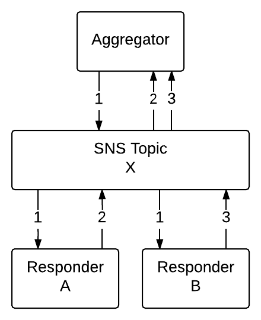
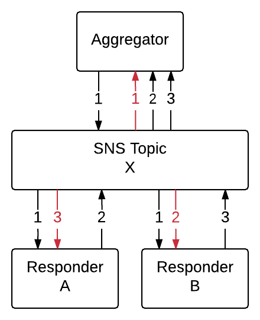
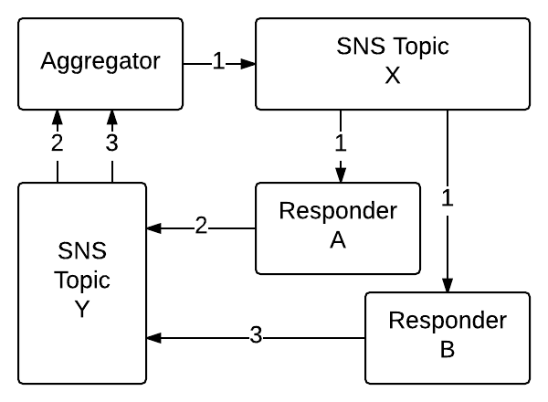

# aws-scatter-gather

The purpose of this module is to facilitate distributed computing while using a scatter gather design pattern with AWS SNS Topics.


# THIS IS CURRENTLY OUT OF DATE - WILL BE FIXED VERY SOON


## Table of Contents

- [Install](#install)
- [Scatter-Gather Overview](#scatter-gather-overview)
- [Code Examples](#code-examples)
- [Getting Started](#getting-started)

## Install

```sh
$ npm install aws-scatter-gather
```

## Scatter-Gather Overview

There are two types of processes involved in scatter-gather:

1. Aggregators - Sends a request and gather's responses.

2. Responders - Receives a request and sends a response.

Look at the following diagram that has one aggregator and two responders:



1. The aggregator publishes out a single request to an AWS SNS Topic.

2. The SNS Topic pushes the event to all subscribers (Responder A and Responder B).

3. Eventually Responder A publishes a response to the SNS Topic that the SNS Topic will push to the aggregator.

4. Eventually Responder B publishes a response to the SNS Topic that the SNS Topic will push to the aggregator.

In reality by having a single SNS Topic for both requests and responses we get a lot of superfluous network chatter, as can be seen in the following diagram:



You can see from this diagram that because the aggregator and responders are subscribed to the same topic that they publish to, that topic pushes the events to the caller as well.

The solution to this is to have two SNS Topics. The aggregator publishes to the topic that responders are subscribed to. Responders publish to the topic that the aggregator is subscribed to. See the following diagram:



## Code Examples

##### Aggregator Example

The aggregator must exist on a computer process that is capable of both sending and receiving SNS Topic events. That pretty much rules out AWS Lambda functions.

Although this example is to the point, a better example can be found in the [Getting Started](#getting-started) section.

```js
const AWS               = require('aws-sdk');
const express           = require('express');
const Scather           = require('aws-scatter-gather');

// create an express app and define the topics
const app = express();
const requestArn = 'arn:aws:sns:us-west-2:064824991063:TopicX'
const responseArn = 'arn:aws:sns:us-west-2:064824991063:TopicY';

// your server will now process AWS SNS Notifications, Subscription Confirmations, etc.
app.use(Scather.server.middleware());

// start the server listening on port 3000
app.listen(3000, function () {

    // subscribe your server to a specific topic arn
    Scather.server.subscribe(responseArn, 'http://my-server.com:3000');

    // define the request configuration
    const aggregator = Scather.aggregator({
        expects: [ 'greet' ],
        responseArn: responseArn
        topicArn: requestArn
    });

    // make the request
    aggregator('Bob', function(err, data) {
        if (err) {
            console.error(err.stack);
        } else {
            console.log(data.greet);    // 'Hello, Bob'
        }
    });
});
```

##### Responder Example

A responder runs best on an AWS Lambda that is subscribed to run on the response SNS Topic ARN.

The name of this particular lambda is `greet` which matches the item that the aggregator expects in the example above.

```js
const AWS       = require('aws-sdk');
const Scather   = require('aws-scatter-gather');

exports.handler = Scather.response(function(message, context, callback) {
    callback(null, 'Hello, ' + message);
});
```


Using this package, aggregators must exist in an environment where it is able to receive SNS Topic events on running processes. Although it's probably possible to do this on an AWS lambda, it's not recommended. Responders on the other hand can exist within long running processes or within short lived processes (like an AWS Lambda).

**If you plan on using Lambdas then the Lambdas must have a role that allows for publishing to AWS SNS Topics.**

## Getting Started

This section of the documentation is a tutorial about getting your first scatter-gather application up and running. We'll talk about local development first and then briefly cover how to get that deployed and ready for production.

The objective of this tutorial is to create a web server that you can post requests to. Each request will use the aggregator to gather results and return them.

1. Create your project directory.

2. Create the responder **double** that will receive a number and publish it's value doubled.

    1. Create a folder within your project directory named `double`.

    2. Within that folder create a file named `index.js`. The name is important because we can plug it directly into an AWS Lambda later.

    3. Inside of `double/index.js` put this code:

    ```js
    'use strict';
    const AWS       = require('aws-sdk');
    const Scather   = require('aws-scatter-gather');

    exports.handler = Scather.response(function(message, context, callback) {
        callback(null, message * 2);
    });
    ```

    4. From the command line or a terminal:

        1. Navigate to your project directory
        2. Navigate into the `double` directory
        3. Type the command `npm init` to create a package.json file.
        4. Install the aws-scatter-gather dependency: `npm install --save aws-scatter-gather`

    5. At this point your project directory should look like this:

        - **my-project**
                - **double**
                    - **node_modules**
                    - index.js
                    - package.json

3. Create a responder **increment** that will receive a number and publish it's value incremented by one.

    1. Create a folder within your project directory named `increment`.

    2. Within that folder create a file named `index.js`. The name is important because we can plug it directly into an AWS Lambda later.

        3. Inside of `increment/index.js` put this code:

        ```js
        'use strict';
        const AWS       = require('aws-sdk');
        const Scather   = require('aws-scatter-gather');

        exports.handler = Scather.response(function(message, context, callback) {
            callback(null, message + 1);
        });
        ```

        4. From the command line or a terminal:

            1. Navigate to your project directory
            2. Navigate into the `increment` directory
            3. Type the command `npm init` to create a package.json file.
            4. Install the aws-scatter-gather dependency: `npm install --save aws-scatter-gather`

        5. At this point your project directory should look like this:

            - **my-project**
                    - **double**
                        - **node_modules**
                        - index.js
                        - package.json
                    - **increment**
                        - **node_modules**
                        - index.js
                        - package.json


### Local Development

1. Structure your file system like this:

    - **my-project**x
        - **double**
            - index.js
            - package.json
        - **increment**
            - index.js
            - package.json
        - **server**
            - aggregators.js
            - index.js
            - test.js
            - package.json
        - orchestra.js
        - package.json

    Be sure to include the `aws-sdk` and `aws-scatter-gather` packages as dependencies in each package.json file.

2. If your computer is behind a NAT or a firewall and you want receive events from the remote AWS SNS then use [ngrok](https://ngrok.com/) or something similar to create a tunnel from the public internet to your local machine. Only do this if you want to receive events from AWS SNS because you'll already get local events.

3. The orchestra.js should be something like this:

    ```js
    const AWS               = require('aws-sdk');
    const Scather           = require('aws-scatter-gather');

    // include lambda index files
    const aggregator        = require('./aggregator/index');
    const double            = require('./double/index');
    const increment         = require('./increment/index');

    // create a mock subscription for the responders
    const requestArn = 'arn:aws:sns:us-west-2:064824991063:TopicY';
    Scather.local.subscribe(requestArn, 'double', double.handler);
    Scather.local.subscribe(requestArn, 'increment', increment.handler);

    // execute the aggregator function
    aggregator.handler({}, {}, function(err, data) {
        console.log(err, data);
    });
    ```

    The above example does not require you to have a network connection to AWS.

4. Run your orchestra.js code in debug mode and use an inspector to troubleshoot errors.


## Without AWS Lambda

It is possible to run both aggregators and responders either on or off AWS Lambdas. This section highlights how to do this off of an AWS Lambda.

To accomplish this:

- You must be running your own NodeJS server that accepts connect middleware.
- You will need to tell the server to use the Scather middleware.
- You will need to make an SNS Topic subscription request using Scather's subscription interface.

Once done, any aggregators or responders that you define will automatically be called as AWS SNS Notifications come in on your server.

##### Express Server Example

[Express](http://expressjs.com/) is one of many NodeJS servers that accept connect middleware.

```js
const AWS               = require('aws-sdk');
const express           = require('express');
const Scather           = require('aws-scatter-gather');

const app = express();

// your server will now process AWS SNS Notifications, Subscription Confirmations, etc.
app.use(Scather.server.middleware());

app.listen(3000, function () {
    console.log('Server listening on port 3000!');
});

// subscribe your server to a specific topic arn
Scather.server.subscribe('arn:aws:sns:us-west-2:064824991063:TopicX', 'http://myserver.com');
```

Note that although it is possible to use the AWS SDK to subscribe to AWS SNS directly, the middleware will not confirm any subscriptions that were not made through `Scather.server.subscribe()`.


## Developing Locally

If you plan to do initial development on your local machine before moving them to AWS Lambdas then here are some tips on how to do that.

1. Structure your file system like this:

    - **my-project**
        - **aggregator**
            - index.js *(similar to [aggregator example](#aws-lambda-better-aggregator))*
            - package.json
        - **double**
            - index.js *(similar to [double example](#aws-lambda-double-response))*
            - package.json
        - **increment**
            - index.js *(similar to [increment example](#aws-lambda-increment-response))*
            - package.json
        - orchestra.js
        - package.json

    Be sure to include the `aws-sdk` and `aws-scatter-gather` packages as dependencies in each package.json file.

2. If your computer is behind a NAT or a firewall and you want receive events from the remote AWS SNS then use [ngrok](https://ngrok.com/) or something similar to create a tunnel from the public internet to your local machine. Only do this if you want to receive events from AWS SNS because you'll already get local events.

3. The orchestra.js should be something like this:

    ```js
    const AWS               = require('aws-sdk');
    const Scather           = require('aws-scatter-gather');

    // include lambda index files
    const aggregator        = require('./aggregator/index');
    const double            = require('./double/index');
    const increment         = require('./increment/index');

    // create a mock subscription for the responders
    const requestArn = 'arn:aws:sns:us-west-2:064824991063:TopicY';
    Scather.local.subscribe(requestArn, 'double', double.handler);
    Scather.local.subscribe(requestArn, 'increment', increment.handler);

    // execute the aggregator function
    aggregator.handler({}, {}, function(err, data) {
        console.log(err, data);
    });
    ```

    The above example does not require you to have a network connection to AWS.

4. Run your orchestra.js code in debug mode and use an inspector to troubleshoot errors.

## API

### aggregator ( configuration ) : Function

Create an aggregator function that can be called to start a scatter gather request.

Creating an aggregator also creates a [local subscription](#local-subscriptions) to the `topicArn` or `responseArn` provided in the config parameter. To end that subscription use the `aggregator.unsubscribe()` function.

Parameters

- *configuration* - The configuration to apply to the aggregator. Any time the aggregator is called it will use this same configuration. Properties for the configuration include:

    - *expects* - An array of strings for function names that the aggregator expects to hear back from. Once all expected responses are received and the `minWait` time has been reached then the aggregator will complete. Defaults to `[]`.
    - *functionName* - The name of the aggregator function. This value is not necessary, but it does help when looking at logs and some response functions might care about the name of the function that is making the request. Defaults to '-'.
    - *maxWait* - The maximum number of milliseconds to wait before stopping response aggregation. Defaults to `2500`.
    - *minWait* - The minimum number of milliseconds to wait before stopping response aggregation. Defaults to `0`.
    - *responseArn* - The SNS Topic Arn that the aggregator will listen on for responses. Defaults to using the `topicArn` if not provided.
    - *topicArn* - The SNS Topic Arn to publish the request on.

Returns an aggregator function with unsubscribe property. **The aggregator function can either use a callback paradigm or a promise paradigm.**

```js
const aggregator = Scather.Aggregator({ topicArn: 'arn:aws:sns:us-west-2:064824991063:TopicX' });

aggregator(5, function(err, data) {
    console.log(results);
});

aggregator(10)
    .then(function(data) {
        console.log(data);
    });

// check current subscription status
console.log(aggregator.subscribed);     // true

// no new aggregator calls after this and unsubscribe will wait
// for running aggregators to finish
aggregator.unsubscribe();
```

### Event Interface

The aws-scatter-gather package is largely event driven. You can ignore the events if you want, or tap into them if you want to do something beyond what the aws-scatter-gather package provides.

**Events**

- **LOG** - This package outputs log information to the LOG event. You can listen to this event if you want to capture all logs that are derived by this package.
- **NOTIFICATION** - This event is fired whenever an AWS SNS Topic event is produced. The events may come from the internal system or from AWS. You can determine if the event come from the aws-scatter-gather package by looking determining if the event property `Record[x].EventSource` is equal to `awssg:local`.
- **PUBLISH** - This event occurs if an event is published by the aws-scatter-gather package.
- **SNS** - This event occurs to report the success of an AWS-SDK call made by the aws-scatter-gather package.
- **SUBSCRIBE** - This event occurs when a subscription is created.
- **UNSUBSCRIBE** - This event occurs when a subscription is ended.

**Example: Capturing all Notification Events**

Notice in the example that the notifications are logged to the console by listening on `events.NOTIFICATION`.

```js
const Scather = require('aws-scatter-gather');
Scather.events.on(Scather.events.NOTIFICATION, function(event) {
    console.log(event);
});
```

#### events.off ([ eventName, ] callback ) : undefined

Once an event has been added you can remove it via this method. The parameters you used to add the listener must be the same parameters to remove the listener.

Parameters:

- *eventName* - Optional. The name of the event to remove the callback for.
- *callback* - The event listener function to remove.

Returns: undefined

#### events.on ([ eventName, ] callback ) : undefined

Add an event listener function that will be called for each event specified.

Parameters

- *eventName* - Optional. The name of the event to call the callback for. If omitted then the callback will be called for all events.
- *callback* - The function to call with the event. The function will only receive one parameter.

Returns: undefined

#### events.once ([ eventName, ] callback ) : undefined

Add an event listener function that will be called just once for the event type specified. After the callback is called once then it will not be called again unless you put it back on the event interface.

Parameters

- *eventName* - Optional. The name of the event to call the callback for. If omitted then the callback will be called for all events.
- *callback* - The function to call with the event. The function will only receive one parameter.

Returns: undefined

## Local Subscriptions

The aws-scatter-gather package uses a two-tier subscription system for transmitting messages. The first tier is local and the second tier is an interface with the AWS SNS system. The entire system can work without using the second tier in what is essentially an offline mode. Here is how it works:

1. An event occurs on the machine.
2. The event propagates to listeners on the local machine.
3. If the AWS has credentials, the Topic Arn is valid, and the server network is [enabled](server-enabled) then the local machine publishes the event the the AWS SNS.
4. Any events from the AWS SNS are propagated to listeners on the local machine.

#### local.subscribe ( topicArn, functionName, handler ) : undefined

Create a local subscription for the specified topic arn to the provided handler.

Parameters

- *topicArn* - The topic to start listening on.
- *functionName* - The name to assign to the lambda function.
- *handler* - The function to remove that is like an AWS lambda handler.

Returns: undefined

#### local.unsubscribe ( topicArn, handler ) : undefined

Remove the local subscription for the specified topic arn to the provided handler.

Parameters

- *topicArn* - The topic to stop listening on.
- *handler* - The function to remove that is like an AWS lambda handler.

Returns: undefined

### logger

#### logger ( namespace [, silent ] ) : Object

Create an aws-scatter-gather logger instance. You can then log to `.info`, `.warn`, or `.error`. Logged events are pushed to the local event interface and handled there.

Parameters

- *namespace* - The name to attach to all log events that describes the domain of events being logged.
- *silent* - Optional. Whether the logging should be silent, being pushed to the local event interface but not logged to the console. Set to true to also log to the console. If not specified then the default silent setting for all logs will be used.

Returns: An object with `.info`, `.warn`, and `.error` properties that are functions that can be called to log information.

```js
// create a logger instance
const Scather = require('aws-scatter-gather');
const myLog = Scather.logger('my-log');
myLog.info('My logger created');
```

#### logger.events

A boolean property value that if set to true will log all events for the system to the console. Defaults to `false`.

```js
// log all events
const Scather = require('aws-scatter-gather');
Scather.logger.events = true;
```

#### logger.silent

A boolean property value that sets the default logging to console mode. If set to true then the logs for the aws-scatter-gather package will be output to the console. Defaults to `true`.

```js
// log scather events to the console
const Scather = require('aws-scatter-gather');
Scather.logger.silent = false;
```

### mock

These functions are used for mocking and testing.

#### mock.requestEvent ( topicArn, message, attributes ) : Object

Create an event that resembles the event that an SNS Topic would send to a lambda function when that event was produced by an aggregator. This is useful for testing Scather.response functions.

Parameters

- *topicArn* - The SNS topic arn.
- *message* - The message value send from the aggregator.
- *attributes* - An object defining the attributes that accompany the message.

Returns: An object that looks like an AWS SNS Event.

### response ( [configuration, ] callback ) : Function

Create a function that is a Scather response generator. A response generator function will only be called when it receives an aggregator request event.

Parameters

- *configuration* - An object that specifies how to run the response. Options include:

    - *development* - If set to true and the response function encounters an error then it will publish the error to the SNS response arn. The aggregator will then capture the response, recognize that it received an answer (but not add it to the final result set), and it will log it.

- *callback* - A function that will accept aggregator event data, process it, and respond to it. The callback has the signature `function ( data, attributes [, done ])` where:

    - *value* - The value sent by the aggregator.

    - *context* - The current context of the event.

    - *done* - Optional. A function that is called when the response is finished. It takes two parameters, `error` and `data`. If there are no errors then set the `error` value to `null`. The value sent as `data` will be the value that the aggregator receives. If this parameter is omitted then the function will return a promise.

Returns: Function. **This function can either use a callback paradigm or a promise paradigm.** When the function is called, if it is called with a third parameter (a callback function) then the callback will be called when completed. If the third parameter is omitted then the function will return a promise.

##### Response Callback Paradigm Example

```js
const AWS = require('aws-sdk');
const Scather = require('./index');

exports.handler = Scather.response(function(message, context, callback) {
    // only the data for aggregator events will cause this function to execute
    callback(null, message * 2);
});
```
##### Response Promise Paradigm Example

This example is not the greatest, but it gets the point across.

```js
const AWS = require('aws-sdk');
const Scather = require('./index');

const respond = Scather.response(function(message, context) {
    // only the data for aggregator events will cause this function to execute
    return message * 2;
});

exports.handler = function(event, context, callback) {
    respond(event, context)
        .then(function(value) {
            callback(null, value);
        })
        .catch(function(err) {
            callback(err, null);
        });
};
```

### server

Helper methods for those who are running their own server.

#### server.enabled

A property that if `true` will allow events to be published to the AWS SNS and notifications to be received by the local machine. Defaults to `true`.

#### server.middleware ( configuration ) : Function

Returns a middleware function that any NodeJS server that supports connect middleware can use to link the server with AWS SNS.

Parameters

- *configuration* - An object representing the middleware configuration. It has the following properties:

    - *passThrough* - Optional. If set to true then once the middleware has completed it will continue to run other server middleware and routes. Defaults to `false`.

Returns: A middleware function.

#### server.subscribe ( topicArn, endpoint ) : Promise

Create an AWS SNS subscription to the specified topic for the server.

Parameters

- *topicArn* - The AWS SNS Topic arn to subscribe to.

- *endpoint* - The public endpoint URL for this server.

Returns: A promise that resolves on subscription confirmation or that rejects on error.

#### server.unsubscribe ( topicArn, endpoint ) : Promise

Remove an AWS SNS subscription to the specified topic for the server.

Parameters

- *topicArn* - The AWS SNS Topic arn to subscribe to.

- *endpoint* - The public endpoint URL for this server.

Returns: A promise that resolves on unsubscribe request completion or that rejects on error.